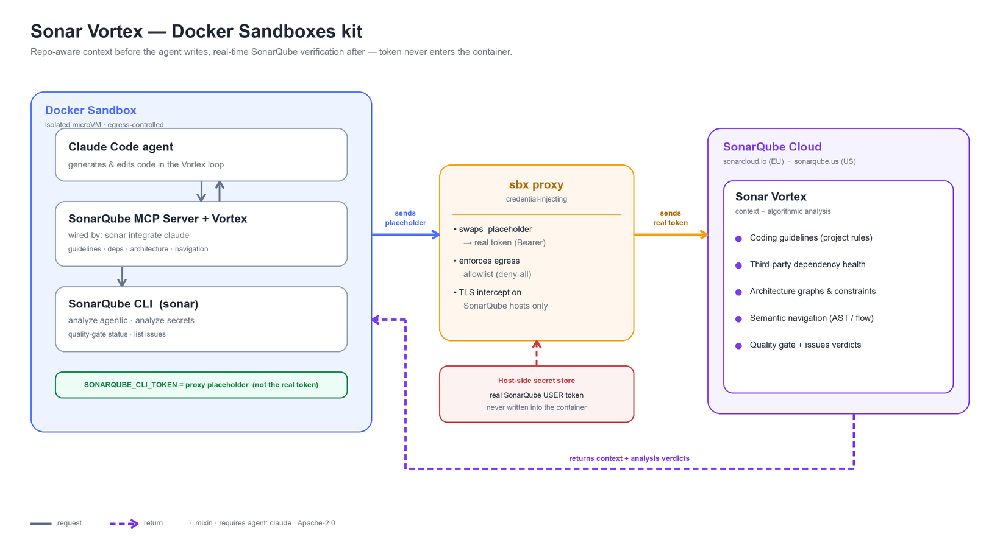

# sbx kit for Sonar Vortex



A [Docker Sandboxes](https://docs.docker.com/ai/sandboxes/) **mixin** that adds
[Sonar Vortex](https://www.sonarsource.com/products/sonar-vortex/) to a Claude
Code sandbox. It installs the [SonarQube CLI](https://docs.sonarsource.com/sonarqube-cli/)
(`sonar`) and runs `sonar integrate claude` to wire the SonarQube MCP Server,
secrets-scanning hooks, and Vortex context, so the agent gets **repository-aware
context before it writes code** (coding guidelines, dependency health,
architecture constraints, semantic navigation) and **verifies every change in
real time** against your SonarQube Cloud quality profiles and rules — using the
same algorithmic analysis engine trusted in production. Your SonarQube token is
proxy-injected and **never enters the container**.

This pairs the sandbox's isolation + egress control with Sonar's real-time AI
code verification: the agent produces higher-quality, more secure code with
fewer tokens and less rework.

## What it does

- Installs the **SonarQube CLI** (`sonar`) natively from the official installer
  and links it into `~/.local/bin` so it's on `PATH` for every shell.
- On start, runs **`sonar integrate claude --global --non-interactive`** to wire
  the **SonarQube MCP Server**, secrets-scanning hooks, and Vortex context into
  Claude Code (best-effort; the agent can re-run it once a valid token is bound).
- Declares one proxy-injected credential — `sonarqube` → **`SONARQUBE_CLI_TOKEN`**
  (the SonarQube CLI's headless-auth token var). Inside the container the token
  reads as a proxy placeholder (never the real value); the sbx proxy swaps in the
  real token on the `Authorization: Bearer` header for outbound calls to SonarQube
  Cloud. Because the CLI runs **natively** (no nested container), it trusts the
  proxy CA and its egress is intercepted for the swap.
- Sets `SONARQUBE_CLI_SERVER` (region) and `SONARQUBE_CLI_ORG` (organization) —
  the CLI's env-var auth needs all three — plus `SONAR_PROJECT_KEY` (optional).
- Allows egress to SonarQube Cloud (`sonarcloud.io` / `sonarqube.us` + `api.*`)
  and the CLI/analyzer download hosts; disables CLI telemetry.
- Ships agent instructions on running the Vortex loop and a runbook
  (`~/runbooks/sonar-vortex.md`).

## Prerequisites

- A **SonarQube Cloud** account with **Sonar Vortex / Sonar Agent** entitlement,
  and a project already analyzed on a long-lived branch (Vortex context is
  project-scoped).
- A **USER token** (Account → Security → *Generate token*). Connected mode
  requires a user token — project, global, or scoped-organization tokens do not
  bind correctly.

## Store your SonarQube token

SonarQube isn't a built-in sbx service, so store the token as a **custom secret**
bound to the SonarQube Cloud host. The container only ever sees a generated
placeholder; the proxy swaps in the real token on the outbound request.

```bash
# EU region (sonarcloud.io) — the default
sbx secret set-custom --host api.sonarcloud.io --env SONARQUBE_CLI_TOKEN --value <user-token>

# US region (sonarqube.us) — if you launch with url=https://sonarqube.us
# sbx secret set-custom --host api.sonarqube.us --env SONARQUBE_CLI_TOKEN --value <user-token>
```

`SONARQUBE_CLI_TOKEN` is the env var the SonarQube CLI reads for headless auth
(paired with `SONARQUBE_CLI_SERVER` / `SONARQUBE_CLI_ORG`, which the kit sets from
the `url` / `org` args). A custom env can only be bound once, so bind it on the
`api.` host — that's the endpoint the CLI calls.

Add `--sandbox <name>` to scope a secret to one sandbox; pass `--ref 'op://…'`
instead of `--value` to source from 1Password without putting the token in your
shell history. Confirm with `sbx secret ls`.

> The real token is stored encrypted host-side and swapped in by the proxy at
> request time. Don't put it in `environment.variables` or in any file in the
> repo.

## Usage

This mixin targets the **`claude`** base agent (it runs `sonar integrate claude`
to wire the MCP server). Only the `--kit` value changes between the forms below.

**Published OCI artifact** (available once merged to `main`):

```bash
sbx run claude --kit docker.io/ajeetraina777/sonar-vortex-kit:latest \
  --kit-arg org=<your-org> .
```

**Git URL** (pin to a commit SHA):

```bash
sbx run claude \
  --kit "git+https://github.com/ajeetraina/sbx-kit-sonar-vortex.git#ref=<40-hex-sha>" \
  --kit-arg org=<your-org> .
```

**Local path:**

```bash
sbx run claude --kit ./sbx-kit-sonar-vortex/ --kit-arg org=<your-org> .
```

### Kit args

| Arg | Default | Description |
|---|---|---|
| `org` | `""` | SonarQube Cloud organization key. **Set this.** |
| `url` | `https://sonarcloud.io` | Region base URL. Use `https://sonarqube.us` for US. |
| `project` | `""` | Optional project key to scope the MCP server + context. |

US region + a project scope, for example:

```bash
sbx run claude --kit docker.io/ajeetraina777/sonar-vortex-kit:latest \
  --kit-arg url=https://sonarqube.us \
  --kit-arg org=my-org \
  --kit-arg project=my-org_my-repo .
```

## The Vortex loop

1. **Before writing code**, the agent pulls project context via the `sonarqube`
   MCP tools — coding guidelines, third-party dependency health, architecture
   graphs/constraints, and semantic navigation.
2. **After each change**, it verifies from the terminal:

   ```bash
   sonar analyze agentic        # fast, agent-oriented analysis of the change
   sonar analyze secrets        # scan for hardcoded secrets
   sonar quality-gate status    # is the project still passing its gate?
   sonar list issues            # issues to fix before finishing
   ```

3. **Fix and re-run** until analysis is clean and the quality gate passes.

The agent instructions shipped with the kit tell the agent to treat a failing
quality gate or a new blocker/critical issue as unfinished work.

## Verify

```bash
sbx exec <sandbox> -- sonar --version
sbx exec <sandbox> -- printenv SONARQUBE_CLI_TOKEN     # -> a proxy placeholder (never a real token)
sbx exec <sandbox> -- printenv SONARQUBE_CLI_SERVER SONARQUBE_CLI_ORG
sbx exec <sandbox> -- sonar auth status                # -> Connected (Source: env vars)
sbx exec <sandbox> -- sonar list projects              # lists your projects with a valid token
sbx policy log <sandbox> | grep -Ei 'sonarcloud|sonarqube'   # calls reached SonarQube Cloud
```

## Governance note

The kit declares an egress allowlist for the SonarQube host, but that inline
allowlist is honored **only when sandbox policy is managed locally**. Under
org-managed governance (`sbx policy ls` shows `Governance: Managed by <org>`), an
org admin must allow the SonarQube host, and egress may be forced *transparent*
(no TLS interception) — in which case the `SONARQUBE_CLI_TOKEN` placeholder is not
swapped and calls return 401. Credential injection needs an intercepting
(local-policy) daemon. See the datadog kit's README for the full governance
walkthrough of the same mechanism.

## Testing (end-to-end)

`scripts/test-kit-e2e.sh` boots a real sandbox with the kit under a throwaway,
scoped `--app-name` daemon (so your day-to-day sbx state is untouched) and
asserts the CLI installed and on `PATH`, the `SONARQUBE_CLI_*` env is wired, the
token arrives as a proxy placeholder (never the real value), and `sonar auth
status` connects. The script never takes the token as an arg/env — store it once
as a custom secret, then run it:

```bash
sbx --app-name sonar-vortex-tck secret set-custom \
  --host api.sonarcloud.io --env SONARQUBE_CLI_TOKEN --value <user-token>
./scripts/test-kit-e2e.sh
```

Useful overrides: `URL=https://sonarqube.us`, `ORG=<org>`, `KEEP=1` (keep the
sandbox to poke at it), `POLICY=` (skip the policy step).

## Architecture

`docs/architecture.png` is generated (no mermaid) by `scripts/gen-architecture.py`
with Pillow — re-run it after edits:

```bash
python3 scripts/gen-architecture.py
```

## Notes

- `environment.variables` uses last-wins composition: a later `--kit` can
  override any `SONARQUBE_*` value set here.
- The MCP server + Vortex context are wired by `sonar integrate claude`, which
  runs the SonarQube MCP Server locally — no Java or nested Docker required. The
  standalone [MCP server JAR/Docker image](https://github.com/SonarSource/sonarqube-mcp-server)
  are alternatives if you prefer to configure it yourself.
- `sonar integrate claude` validates the token against SonarQube Cloud, so it only
  completes with a **valid** bound token; otherwise re-run it from a shell.
- Docs: <https://www.sonarsource.com/products/sonar-vortex/> ·
  <https://docs.sonarsource.com/sonarqube-cli/>

## License

Apache-2.0
